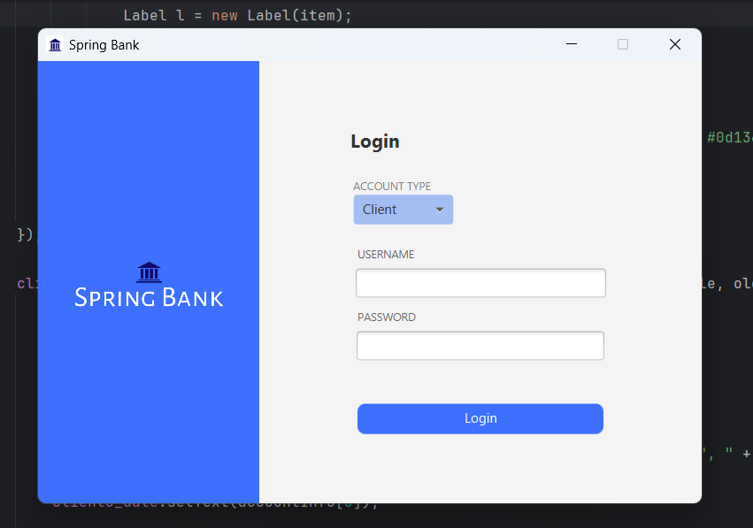
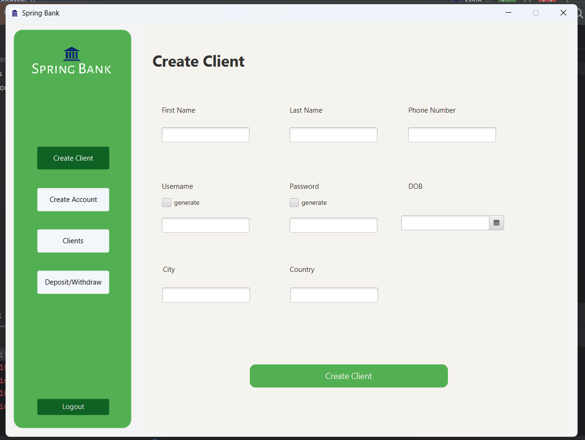
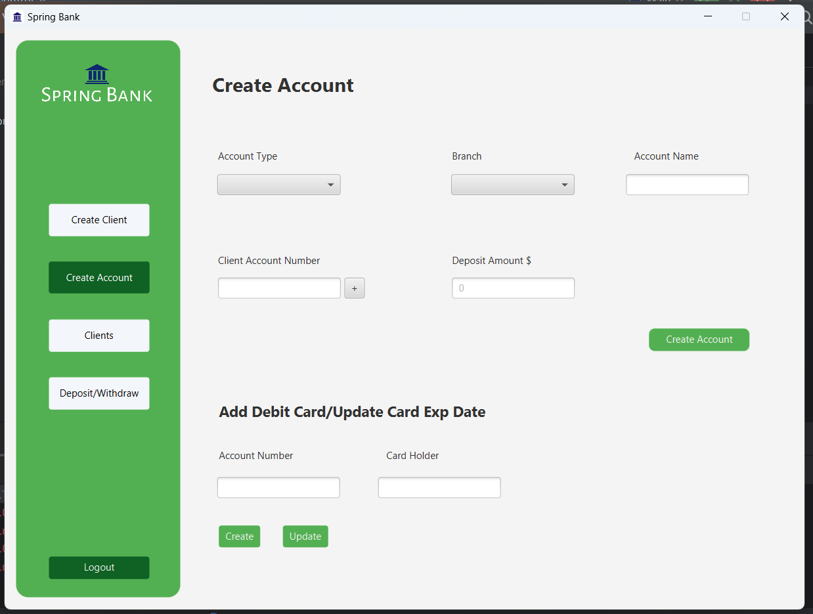
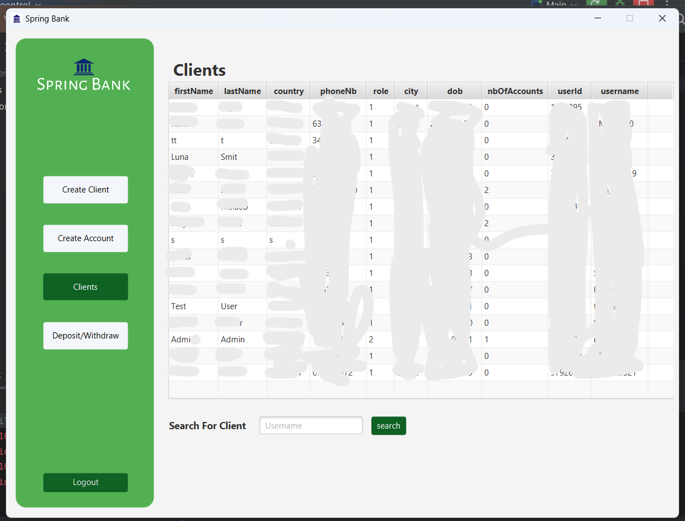
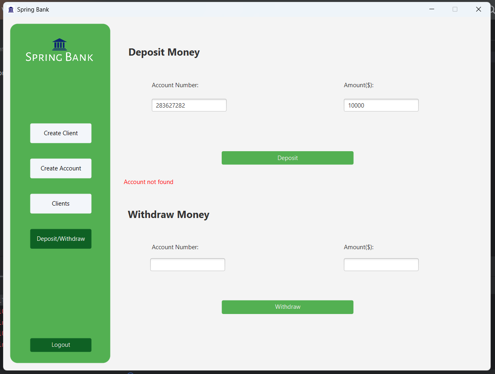
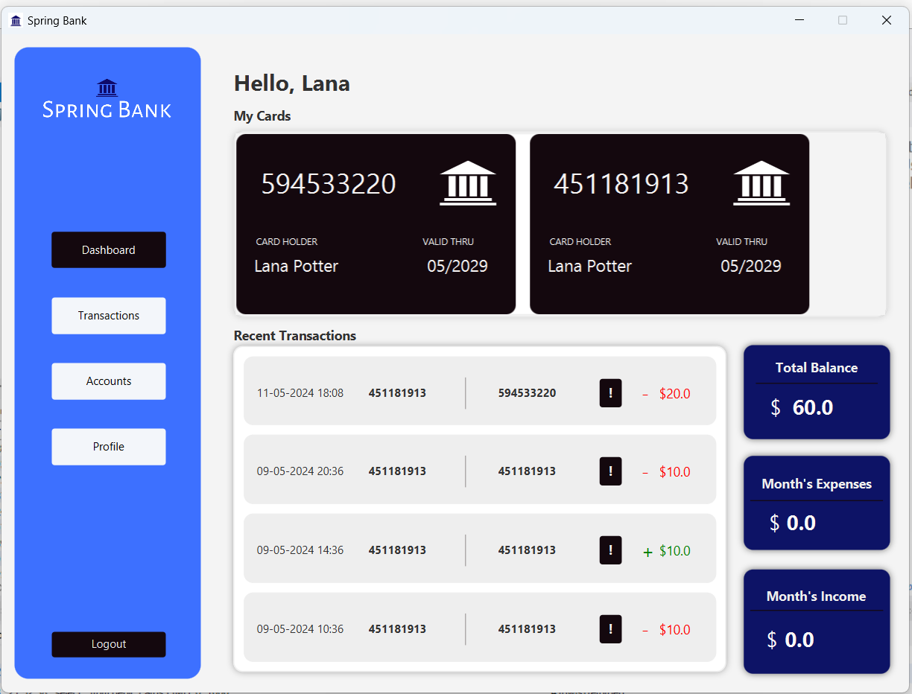
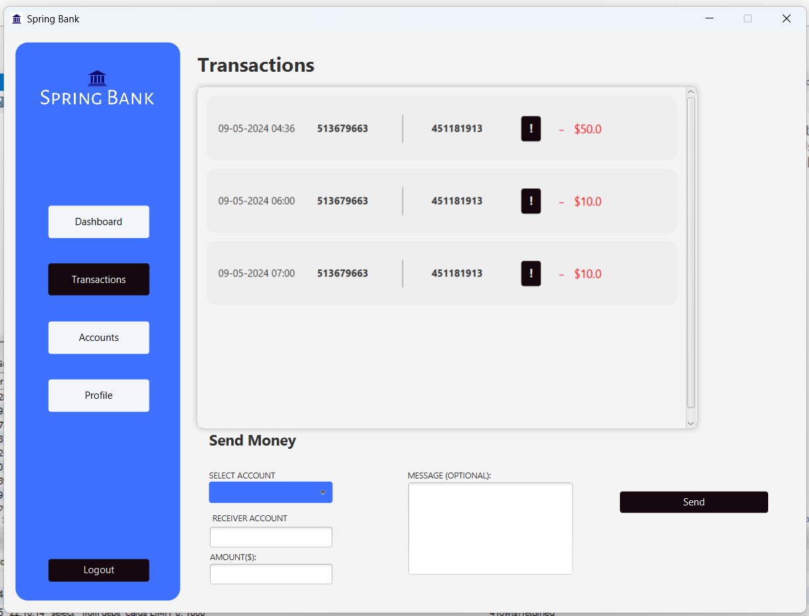
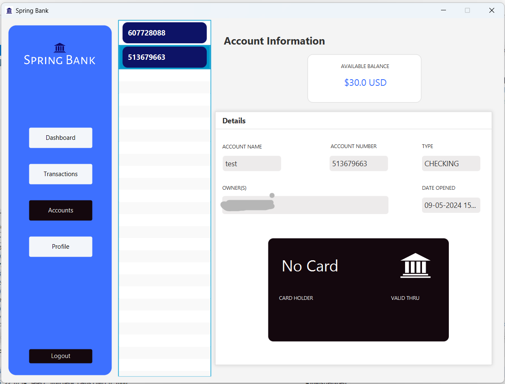
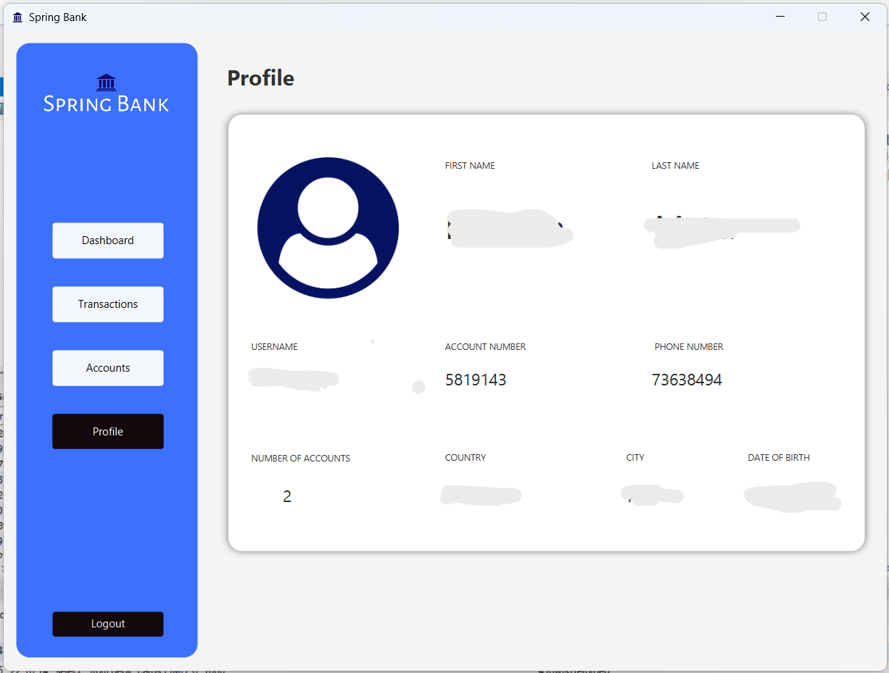

# spring-bank
Spring Bank is a banking management application that is designed to help users do transactions and see logistics of their activities as well and checking the overall status of their account(s). This application has both user and admin panels. I used Springboot Java for backend and FXML for frontend.

# Screenshots

